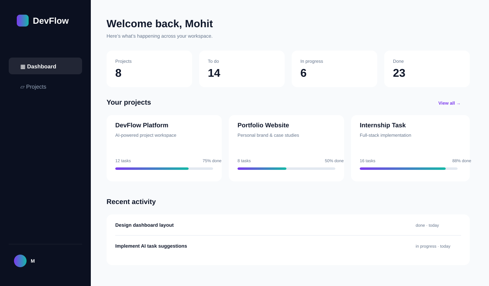
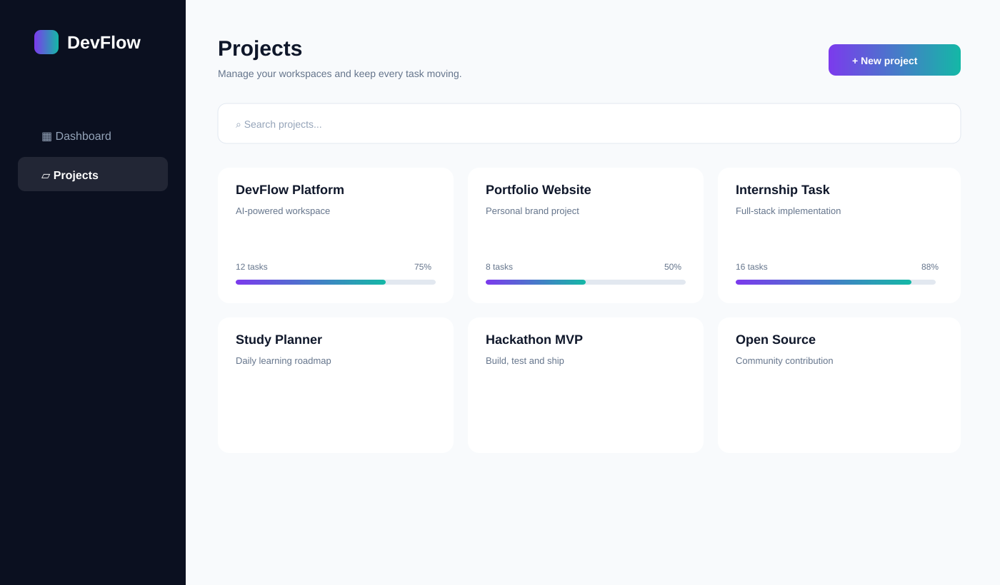
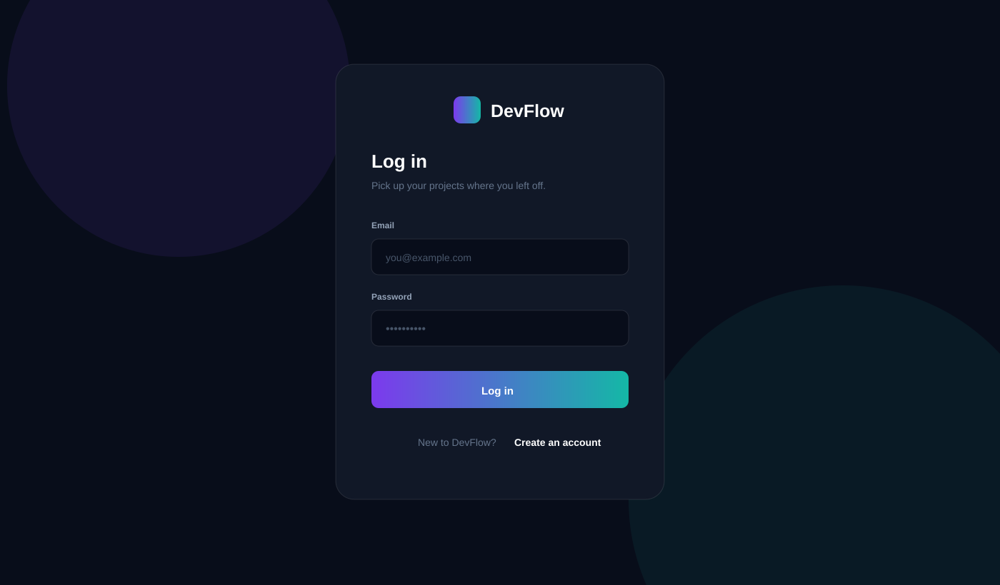

<div align="center">

# ⚡ DevFlow AI

### Premium project, task & productivity workspace

**Turn busy work into clear momentum.**

<p>
  <a href="https://devflow-ai-nu.vercel.app/"></a>
  <a href="https://github.com/Mohitrath/Full-stack-internship"></a>
  
  
  
</p>

<p>
  <strong>Projects</strong> •
  <strong>Tasks</strong> •
  <strong>Calendar</strong> •
  <strong>AI Copilot</strong> •
  <strong>Analytics</strong> •
  <strong>Settings</strong>
</p>

</div>

---

## 🌐 Live Preview

### 👉 [Open DevFlow AI](https://devflow-ai-nu.vercel.app/)

The current showcase build is optimized for a fast browser-based demo on Vercel, with local persistence so the core workspace remains usable without a separate backend service.

---

## ✨ Interface Showcase

> A visual tour of the current DevFlow AI experience.

### 🏠 Dashboard

<p align="center">
  
</p>

### 📁 Project Workspace

<p align="center">
  
</p>

### 🔐 Authentication

<p align="center">
  
</p>

---

## 🎯 What is DevFlow AI?

DevFlow AI is a polished productivity workspace for developers and product teams. It brings projects, tasks, deadlines, planning and AI-assisted execution into one focused interface.

The current showcase build is intentionally lightweight and works directly in the browser. Demo data is stored with `localStorage`, making the Vercel deployment interactive without requiring a separate database connection for the core demo flows.

---

## 🚀 Core Features

| Area | What you can do |
|---|---|
| 🏠 **Overview** | See workspace health, completion progress, active work and recent activity |
| 📁 **Projects** | Create, edit and delete projects with descriptions and due dates |
| ✅ **Tasks** | Create, edit, delete, search, filter and update task status |
| 📅 **Calendar** | Browse scheduled tasks by month and navigate across dates |
| 🤖 **AI Copilot** | Turn a brief into a practical delivery plan and add generated tasks |
| 📊 **Analytics** | See live project, task, completion and in-progress metrics |
| 🔔 **Notifications** | Open the notification center and manage unread state |
| 👤 **Profile** | Open the profile menu, reach settings, help and sign out |
| ⚙️ **Settings** | Update profile details and reset demo data |
| 💾 **Persistence** | Keep demo projects and tasks across browser refreshes |
| 📱 **Responsive UI** | Desktop and mobile-friendly navigation with a collapsible sidebar |

---

## 🧠 Product Experience

DevFlow is built around a simple loop:

```text
Capture → Organize → Prioritize → Execute → Review
   ↓          ↓           ↓           ↓        ↓
Projects    Tasks       Filters      AI      Analytics
                                  Copilot
```

The goal is to reduce friction between **planning work** and **actually shipping it**.

---

## 🛠️ Tech Stack

### Frontend

- **React 18**
- **Vite 7**
- **Lucide React**
- Custom responsive CSS
- Browser `localStorage` for showcase persistence

### Deployment

- **Vercel**
- Vite production build
- SPA route fallback for workspace pages

### Repository

- GitHub
- `main` branch connected to the Vercel deployment

---

## 📂 Project Structure

```text
Full-stack-internship/
├── devflow-ai/
│   ├── client/
│   │   └── src/
│   │       ├── WorkspaceApp.jsx
│   │       ├── main.jsx
│   │       └── styles/
│   │           ├── global.css
│   │           └── workspace.css
│   ├── api/                  # Vercel API files from the full-stack version
│   ├── serverless-api.js
│   ├── vercel.json
│   └── package.json
├── docs/
│   ├── dashboard.svg
│   ├── projects.svg
│   └── login.svg
├── README.md
└── ...
```

---

## ⚡ Run Locally

### 1. Clone

```bash
git clone https://github.com/Mohitrath/Full-stack-internship.git
cd Full-stack-internship/devflow-ai
```

### 2. Install dependencies

```bash
npm install
```

### 3. Start the client

```bash
npm run dev --prefix client
```

Open the local Vite URL shown in your terminal.

---

## 🔑 Demo Access

The showcase authentication is designed for a frictionless demo flow.

```text
Email:    demo@devflow.app
Password: Demo123!
```

You can also use **Use demo workspace** from the sign-in screen.

---

## 🧪 Recommended Demo Flow

For a quick product walkthrough:

1. Open the **Dashboard**.
2. Go to **Projects** and create a project.
3. Open **Tasks** and create a task.
4. Change the task status and apply filters.
5. Open **Calendar** and browse the scheduled work.
6. Use **AI Copilot** to generate a delivery plan and add tasks.
7. Check **Analytics** for updated metrics.
8. Open the **notification bell** and **profile menu**.
9. Visit **Settings** to update the profile or reset the demo workspace.

---

## 🎨 Design Direction

DevFlow uses a premium productivity aesthetic built around:

- Deep navy workspace navigation
- Violet / indigo gradient actions
- Spacious white content cards
- Strong visual hierarchy
- Rounded surfaces and soft shadows
- Clear states for status, priority and progress
- Responsive behavior for smaller screens

The result is a modern interface intended to feel closer to a polished product than a basic internship CRUD demo.

---

## 🏆 Internship Submission

**Program:** Innovation Hacks — Full Stack Development Internship  
**Project:** DevFlow AI — Project & Task Management Workspace

The project demonstrates frontend engineering, responsive UI design, client-side state management, CRUD-style interactions, AI-assisted planning UX, analytics, routing, and deployment on Vercel.

---

## 🔮 Future Enhancements

- Team collaboration and role-based permissions
- Real-time comments and activity feeds
- Persistent cloud database
- GitHub / GitLab integration
- Drag-and-drop Kanban boards
- Real AI provider integration
- Calendar reminders and push notifications
- Advanced productivity analytics
- CI/CD and automated testing

---

## ⭐ Support the Project

If you like the design or find the project useful, consider giving the repository a ⭐ on GitHub.

<div align="center">

**Built with React + Vite + Vercel ⚡**

</div>
